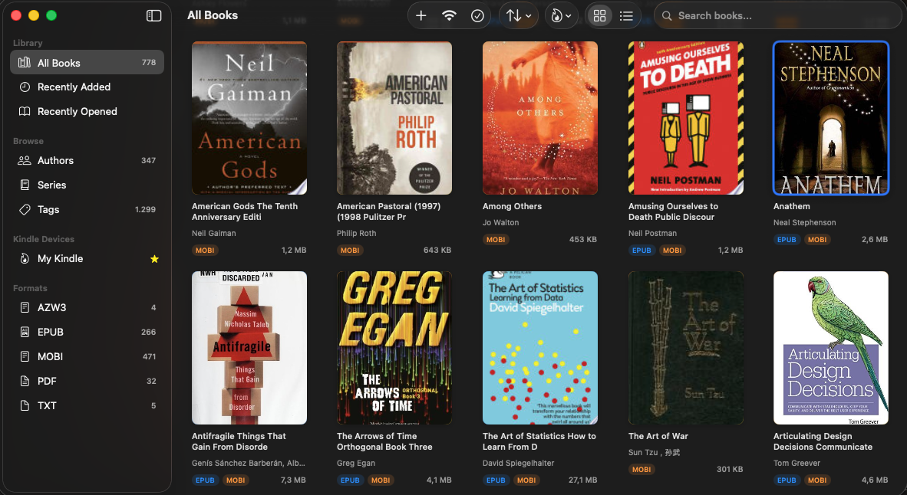

# Folio



**The Beautiful Ebook Library for Mac**

Manage your ebooks with a gorgeous interface and transfer wirelessly to your devices. No cables, no complexity.

[]()
[](LICENSE)
[]()

---

## The Problem

Calibre is powerful but overwhelming. You just want to organize your ebooks and send them to your Kindle—without fighting complicated software.

## The Solution

**Folio:** Beautiful native macOS app that does the essentials perfectly.

- 🎨 Beautiful grid-based library interface
- 📡 WiFi transfer to any device via browser
- 📧 Send to Kindle via email (EPUB preferred — Amazon converts to AZW)
- 🧠 Automatic covers and metadata from Google Books & Open Library
- 📚 Smart grouping of same book in multiple formats
- 🔒 Private, open source, completely free

---

## Features

### Implemented (Phase 1)

| Feature | Status |
|---------|--------|
| **Book Management** | ✅ |
| Import EPUB, MOBI, PDF, AZW3, CBZ/CBR | ✅ |
| Drag & drop import | ✅ |
| Grid view with cover images | ✅ |
| Sort by title, author, date added, file size | ✅ |
| Table view with sortable column headers | ✅ |
| Multi-select with Cmd+A support | ✅ |
| Same book format grouping (EPUB + MOBI = 1 item) | ✅ |
| **Metadata** | ✅ |
| Auto-fetch from Google Books & Open Library APIs | ✅ |
| Cover images, authors, series, tags | ✅ |
| Detailed book info view | ✅ |
| **Organization** | ✅ |
| Browse by Author, Series, Tags, Format | ✅ |
| Search across library | ✅ |
| Recently Added / Recently Opened views | ✅ |
| **Wireless Transfer** | ✅ |
| Built-in HTTP server | ✅ |
| Mobile-friendly web interface | ✅ |
| Download books to any device via browser | ✅ |
| **Kindle Integration** | ✅ |
| Send to Kindle via email | ✅ |
| Multiple Kindle device support | ✅ |
| SMTP email configuration | ✅ |
| Auto-select best format (EPUB > AZW3 > PDF) | ✅ |
| **Format Conversion** | ✅ |
| Convert between EPUB, MOBI, PDF, AZW3 | ✅ |
| Powered by Calibre ebook-convert | ✅ |

### Implemented (Phase 2)

| Feature | Status |
|---------|--------|
| Bonjour zero-config network discovery | ✅ |
| QR code for easy mobile connection | ✅ |
| Native Swift SMTP (sandbox compatible) | ✅ |
| Keyboard zoom controls (Cmd++/−/0) | ✅ |

### Planned (Future)

- iOS app with sync
- USB transfer support
- Collections and smart folders
- Reading progress sync
- On-device LLM metadata enhancement

---

## Key Use Cases

### Library Books → Kindle
Download from Libby/OverDrive → Import to Folio → One-click "Send to Kindle" → Reading in 60 seconds

### Public Domain Books → Any Device
Download EPUBs → Folio organizes with covers → Transfer wirelessly via browser → Done

### Format Conversion
Have an EPUB, need MOBI? Folio converts automatically when sending to Kindle.

### Multiple Formats, One View
Have the same book in EPUB and MOBI? Folio groups them as one item, showing all format badges.

---

## Architecture

Folio is built as a **4-layer cake** where data flows strictly downward:

```
┌─────────────────────────────────────────────┐
│  VIEWS (what users see)                     │  SwiftUI — grid, table, sidebar
├─────────────────────────────────────────────┤
│  SERVICES (what coordinates things)         │  LibraryService — the "brain"
├─────────────────────────────────────────────┤
│  REPOSITORIES (what talks to the database)  │  BookRepository — CRUD on books
├─────────────────────────────────────────────┤
│  CORE DATA (the database)                   │  6 entities: Book, Author, Series...
└─────────────────────────────────────────────┘
```

### Two Modules

- **`Folio/`** — the macOS app (SwiftUI views, state management, UI models)
- **`FolioCore/`** — a Swift Package with **zero UI code** (HTTP server, metadata APIs, Kindle email, format conversion, Bonjour). An iOS app can reuse all of this.

### The Key Abstraction: BookGroup

Users don't see files — they see *books*. If you have `Dune.epub` and `Dune.mobi`, Folio groups them into **one BookGroup** with two format badges. Grouping happens by ISBN first, falling back to normalized title. Every UI surface works with BookGroups, not raw Book entities.

### Core UX Loop

```
User drops files → ImportService saves to Core Data → BookGroupingService groups them
→ Grid/Table displays BookGroups → .task modifier auto-fetches metadata → Cover appears
```

### Key Files

| File | What It Controls |
|------|-----------------|
| `ContentView.swift` | Main layout — sidebar + content, toolbar, all state |
| `BookGroupViews.swift` | How books look in the grid — covers, badges, context menus |
| `BookTableView.swift` | Table view with sortable column headers |
| `BookGroup.swift` | How files become visual "books," format priority |
| `SortOption.swift` | Sort options and their default directions |
| `LibraryService.swift` | Facade — one door to all business logic |
| `BookRepository.swift` | All Core Data operations |
| `FormatStyle.swift` | Color gradients and icons per format |

### Dependencies (only 3)

| Dependency | Purpose |
|-----------|---------|
| [Swifter](https://github.com/httpswift/swifter) | HTTP server for WiFi transfer |
| [Kingfisher](https://github.com/onevcat/Kingfisher) | Image caching for cover downloads |
| [SwiftyJSON](https://github.com/SwiftyJSON/SwiftyJSON) | JSON parsing for API responses |

Everything else is native Apple frameworks (Core Data, Network.framework, Core Image, SwiftUI).

---

## Requirements

- macOS 13.0 or later
- [Calibre](https://calibre-ebook.com/) (for format conversion)
- For Send to Kindle: Gmail or SMTP email account

---

## Building from Source

```bash
git clone https://github.com/sarthakpranit/Folio.git
cd Folio
open Folio.xcodeproj
```

Build and run with Xcode 15+.

---

## Notes

- Works with **DRM-free ebooks only** (library books, public domain, personal files)
- Uses Calibre's conversion engine (proven quality)
- GPL v3 licensed

---

<p align="center">
⭐ Star to follow progress • Made with ❤️ for readers
</p>
